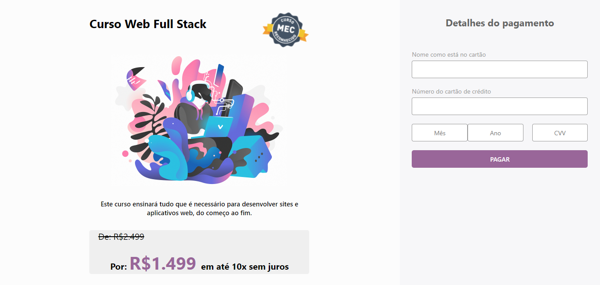

# Algoritmo de Luhn

## Sumário

- [1. Introdução](#1-introdução)
- [2. Ideação do projeto](#2-ideação-do-projeto)
- [3. Implementações futuras](#3-implementações-futuras)
- [4. Metodologia Ágil](#5-metodologia-agil)
- [5. Design do projeto](#6-design-do-projeto)
- [6. Capturas de tela](#7-capturas-de-tela)
- [7. Tecnologias utilizadas](#8-tecnologias-utilizadas)
- [8. Como usar](#9-como-usar)

---

## 1. Introdução

O algoritmo de Luhn foi desenvolvido por Hans Peter Luhn, da IBM, em 1954. Ele é capaz de detectar um erro simples em um dígito, assim como a maioria das transposições de um dígito com os dígitos adjacentes. Este algoritmo verifica se um número de cartão é bem formado. Saiba mais em: [UFRGS](http://www.inf.ufrgs.br/arq/wiki/lib/exe/fetch.php?media=wiki:trab:cesar:2008-2-numero_de_cartao_de_credito.pdf)

Este algoritmo nos retorna o resultado realizando o seguinte teste:

1 - Inverto o número, no sentido da esquerda pra direita. Por exemplo, o número 1234567890123 seria reescrito como 3210987654321. E dobro o valor das casas pares: 3(4)1(0)9(16)7(12)5(8)3(4)1.    

2- Caso o resultado da soma seja um número com dois dígitos, soma entre eles. Exemplo: 3(4)1(0)9(16)7(12)5(8)3(4)1, 16 ficaria 7 ( 1 + 6 ), 12 ficaria 3 ( 1 + 2 ).

3- Somo todos os dígitos, sendo as pares com o valor dobrado.

4 - Se o resultado dessa soma for divisível por 10, é válido. Se não, é inválido.

## 2. Ideação do projeto

O objetivo desse projeto é simular uma página de oferta de um serviço onde encontra-se na etapa de inserção de dados referentes ao cartão de crédito. No qual faz a validação do número do cartão utilizando o algortimo de Luhn.

## 3. Implementações futuras

A implementar função que identifique a bandeira do cartão e ao identificar mostrar o logotipo.

## 4. Metodologia Ágil

Para me organizar durante as Sprints do projeto, utilizei o Trello. O que facilitou alcançar objetivos maiores através dos babies steps. 
Assim como as cerimonias da metodologia ágil: Daily, Sprint Planning, Sprint Review, Sprint Retrospective, e Sprint Checkout.

## 5. Design do projeto

Fiz um prototipo de baixa fidelidade utilizando folha de papel e lápis.

<!--  -->

## 6. Capturas de tela

   

## 7. Tecnologias utilizadas

- HTML5
- CSS3
- JavaScript Vanilla
- Node.js
- Git e GitHub
- Trello

## 8. Como usar

Você precisará usar o Node.js

Clonar o projeto

` $ git clone `

Instalar as dependências do projeto

` $ npm i `

Iniciar a aplicação

` $ npm run start `

Realizar os testes unitários

` $ npm test `

---

Criado por 